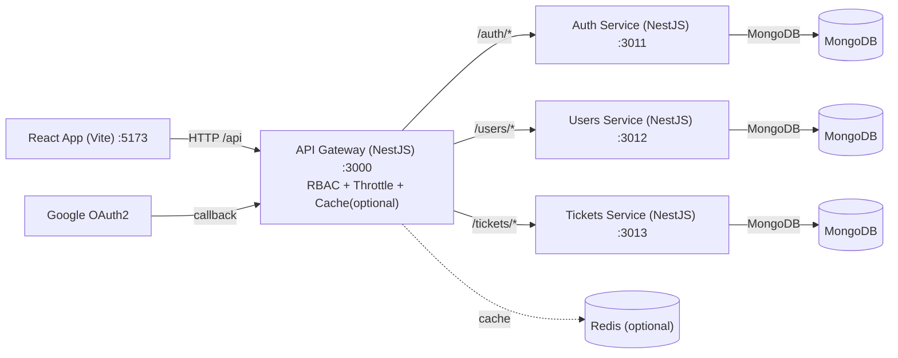

Ticketing Frontend (React + Vite)

Overview

- React + TypeScript app built with Vite
- Auth via JWT from backend gateway; optional Google OAuth handled by the gateway and redirected back to the app with `?token=`
- Uses a single API base URL pointing to the gateway

Environment variables

Create `frontend/.env` (or `.env.local`) with:

```bash
VITE_BACKEND_URL=http://localhost:3000/api
```

Loom Link - https://www.loom.com/share/68079227fcda4b4388240741956f959e?sid=444fe486-15ac-4ccc-aacb-ef7d9a8607b6


Install and run

1. Node.js 18+
2. From `frontend/`: `npm install`
3. Dev server: `npm run dev` (default at `http://localhost:5173`)
4. Build: `npm run build`; Preview: `npm run preview`

Authentication flow

- Email/password: `POST /api/auth/login` returns `{ accessToken }` which is stored in `localStorage` under `utms_token`.
- Google OAuth: redirect to `/api/auth/google`; after success, gateway redirects to the app `FRONTEND_REDIRECT_URL` with `?token=`; the app captures and stores it.
- Profile: `GET /api/auth/me` returns user data; the UI maps roles to permissions client-side.

Key files

- `services/apiClient.ts`: base HTTP utility reading `VITE_BACKEND_URL`; manages token storage
- `services/auth.service.ts`: login and OAuth helpers
- `contexts/AuthContext.tsx`: global auth state, token handling, guards
- `components/` and `pages/`: UI modules for tickets and users

Architecture diagram



Assumptions

- The app expects the gateway to expose all endpoints under `/api`.
- A single `VITE_BACKEND_URL` is used for all resources.
- The gateway handles OAuth and redirects with `?token=` which is then stored by the client.

